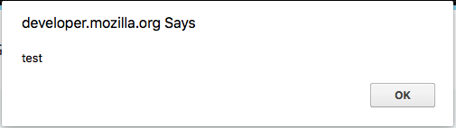
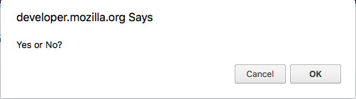
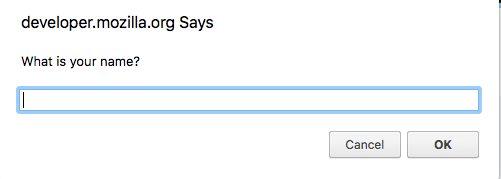

## `alert`, `confirm`, `prompt`
The easiest way to take user input (for now), is to use `alert()`, `confirm()` and `prompt()`. These are methods on the Window object that will create popup windows and either present the user with information or ask for input.

We will eventually be integrating forms, but we haven't learned how to extract data from them yet.

### `alert`
`alert` is a function that is built into browsers that causes a popup to be displayed to the user with a specific message. The message is set by passing a string argument to the function.



`alert` does not have a return value.

```js
alert("Test message");
```

### `confirm`
`confirm` allows us to get a boolean yes or no response from the user. A popup box is displayed by the browser that has our message as well as `ok` or `cancel` options. Clicking `ok` returns a value of true, while `cancel` returns false.



```js
var confirmation = confirm("Yes or No?");
```
### `prompt`
`prompt` allows us to take text input from a user via a popup box. The window displays the provided message as well as a text input area for the user to type. The `ok` button will return the text the user enters as a string, while the `cancel` button will return `null`.



```js
var response = prompt("What is your name");
```

### Example
Let's use these to practice event listeners:

```html
<!DOCTYPE html>
<html>
  <head>
    <title>Some Page</title>
    </head>
    <body>
        <button id='btn'>Request Information</button>

        <h3></h3>

        <script type="text/javascript">
            var btn = document.getElementById('btn');

            // create event listener
            btn.addEventListener('click', function(e) {

            	// store boolean in response variable
                var response = confirm('Would you like to receive our newsletter?');

                // if 'ok'
                if (response) {
                	// prompt user to enter email
                    var email = prompt('Enter your email');
                    // popup message success
                    alert('You will now receive our newsletter to ' + email);
                } else {
                	// popup message failure
                    alert('Sorry, the newsletter is the only information available');
                }
            });
        </script>
    </body>
</html>
```

> ###  Skill Drill
> * Refactor your click event from the earlier example to alert the user the button has been clicked.

<hr>

[Prev](removingEvents.md) | [Up](README.md) | [Next](eventObject.md)

